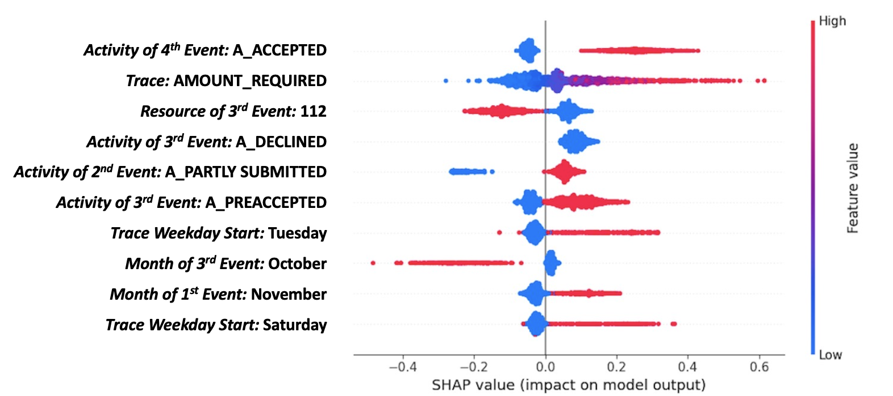
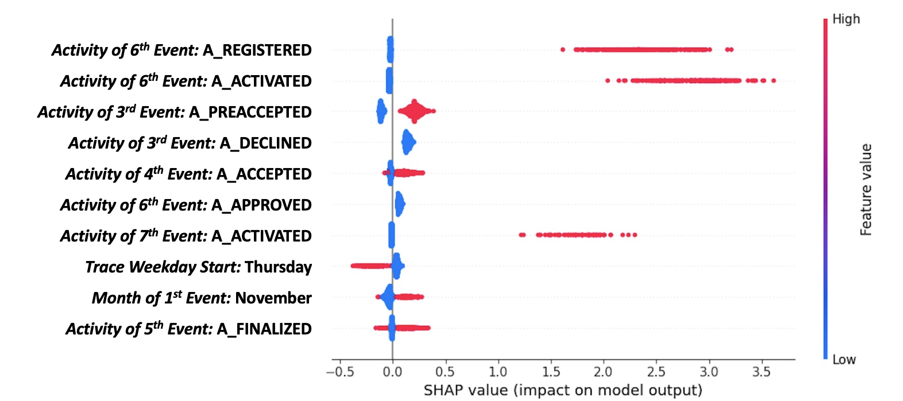
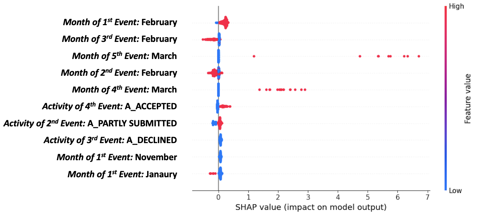

# Usage of this repository
This repository is supposed to help to reproduce the work proposed in the paper "Business Process Deviation Prediction: Predicting Non-Conforming Process Behavior"

The file "BPDP_Code.ipynb" contains all code used to implement and evaluate the proposed approach. The function "BPDP_classification_CIBE" executes the approach using the complex index-based encoding while the function "BPDP_classification_MPPN" uses the pre-trained feature vectors from MPPN. This folder contains all event logs, to-be models, and frozen alignments. Please load the respective data from the folder "Datasets" before. 

To train BPDP using the feature vectors created by MPPN:
- Train the MPPN using the code from https://github.com/joLahann/mppn
- Store the feature vectors per prefix in a pandas dataframe. Each row represents one prefix where "idx" is the unique id of the prefix and "FV" the learned feature vector of it

The folder "Evaluation" contains all evaluation results displayed in the paper. 

# Precision, Recall, and F1-Score for a Single Classifier for all Deviations (BPDP_SC,CIBE) and for Multiple Classifier without Undersampling and Weighted Loss (BPDP_MC,No Imbalance)
As mentioned in Sections IV-C and VII respectively, the following table illustrates that BPDP_SC,CIBE and BPDP_MC,No Imbalance perform worse than the proposed approaches BPDP_CIBE and BPDP_MPPN.

|      CIBE Single Classifier     | CIBE Multiple No Imbalance |        | CIBE Multiple Classifier |        | MPPN Multiple Classifier |        |
|:----------------------:|:------:|:--------------------------:|:------:|:------------------------:|:------:|:------------------------:|:------:|
|           Dev          | No Dev |             Dev            | No Dev |            Dev           | No Dev |            Dev           | No Dev |
|         0.0877         | 0.9410 |           0.4495           | 0.9262 |          0.1620          | 0.9669 |          0.1405          | 0.9480 |
|         0.9251         | 0.1186 |           0.1074           | 0.9927 |          0.8084          | 0.6563 |          0.6636          | 0.5733 |
|         0.5218         |        |           0.5500           |        |          0.7324          |        |          0.6185          |        |
|         0.7619         | 0.8830 |           0.7619           | 0.8830 |          0.2019          | 0.9625 |          0.1798          | 0.9652 |
|         0.1706         | 0.9959 |           0.1706           | 0.9959 |          0.7981          | 0.5348 |          0.8089          | 0.4588 |
|         0.5832         |        |           0.5832           |        |          0.6665          |        |          0.6339          |        |
|         0.7258         | 0.9934 |           0.6387           | 0.9959 |          0.1401          | 0.9982 |          0.0314          | 0.9980 |
|         0.1575         | 0.9995 |           0.4349           | 0.9985 |          0.7619          | 0.8897 |          0.6459          | 0.7876 |
|         0.5784         |        |           0.7167           |        |          0.8258          |        |          0.7168          |        |
|         0.3911         | 0.9849 |           0.2968           | 0.9882 |          0.0720          | 0.9938 |          0.0741          | 0.9973 |
|         0.0005         | 1.0000 |           0.2409           | 0.9933 |          0.6333          | 0.8223 |          0.6239          | 0.8456 |
|         0.5002         |        |           0.6171           |        |          0.7270          |        |          0.7348          |        |
|         0.2973         | 0.9952 |           0.3746           | 0.9953 |          0.0402          | 0.9979 |          0.0291          | 0.9985 |
|         0.1083         | 0.9993 |           0.3202           | 0.9977 |          0.6888          | 0.8353 |          0.6486          | 0.8180 |
|         0.5537         |        |           0.6590           |        |          0.7620          |        |          0.7333          |        |
|         0.0294         | 0.9896 |           0.3144           | 0.9931 |          0.0457          | 0.9969 |          0.0270          | 0.9971 |
|         0.0012         | 0.9996 |           0.3005           | 0.9939 |          0.5566          | 0.8514 |          0.5511          | 0.7664 |
|         0.5004         |        |           0.6472           |        |          0.7040          |        |          0.6587          |        |
|         0.0612         | 0.9615 |           0.2109           | 0.9592 |          0.0993          | 0.9748 |          0.0956          | 0.9971 |
|         0.0035         | 0.9982 |           0.1067           | 0.9610 |          0.7162          | 0.5906 |          0.5644          | 0.7391 |
|         0.5007         |        |           0.5338           |        |          0.6534          |        |          0.6518          |        |

# Further Shapley value plots
The following graphs show Shapley value plots for all deviations of the BPIC 12A event log. 

## ('>>', 'A_APPROVED')

## ('A_APPROVED', '>>')

## ('>>', 'A_DECLINED')

# Evaluation metrics per deviation type for BPIC 12A

To illustrate the varying performance over deviations, we show the evaluation metrics for the three deviation types in BPIC 12A individually.

|           | Dev                                                           |||| No Dev                                                        ||||
|-----------|------------------|------------------|------------------|---------|------------------|------------------|------------------|---------|
|Metric     | (>>, A_APPROVED) | (A_APPROVED, >>) | (>>, A_DECLINED) | Average | (>>, A_APPROVED) | (A_APPROVED, >>) | (>>, A_DECLINED) | Average |
| Precision | 0.1587           | 0.2166           | 0.1108           | 0.1620  | 0.9576           | 0.9468           | 0.9964           | 0.9669  |
| Recall    | 0.7770           | 0.7557           | 0.8926           | 0.8084  | 0.5503           | 0.6143           | 0.8043           | 0.6563  |
| ROC_AUC   | 0.6637           | 0.6850           | 0.8485           | 0.7324  | 0.6637           | 0.6850           | 0.8485           | 0.7324  |
 
