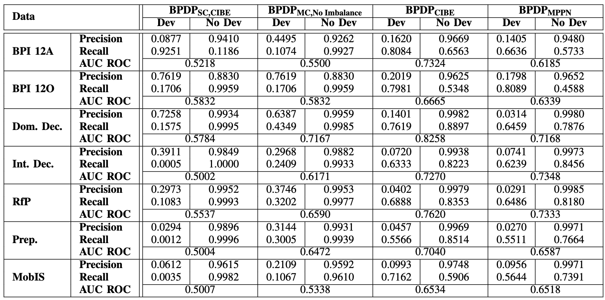

# Usage of this repository
This repository is supposed to help to reproduce the work in the paper "Business Process Deviation Prediction: Predicting Non-Conforming Process Behavior". The corresponding approach BPDP was originally proposed in [1] and is currently under review for an extension.

The file "BPDP_Code.ipynb" contains all code used to implement and evaluate the proposed approach. The function "BPDP_classification_CIBE" executes the approach using the complex index-based encoding (BPDPCIBE) while the function "BPDP_classification_MPPN" uses the pre-trained feature vectors from MPPN (BPDPMPPN) as used in [1].

To execute the classification using the Genga et. al. approach [2], use the function "genga_benchmark". For the CatBoost classification (CatBoost) or XGBoost (XGBoost), execute "classify_cat" or "classify_xgb" correspondingly and to use suffix prediction for deviation prediction (Suffix Prediction), execute "suffix_prediction_deviations".

To execute BPDP using a single classifier (BPDPSC,CIBE), execute "BPDP_single_classifier". For BPDP without undersampling and weighted loss (BPDPMC,No Imbalance), use "BPDP_no_imbalance".

The folder "Evaluation" contains all evaluation results displayed in the paper. This folder contains all event logs, to-be models, and frozen alignments. Please load the respective data from the folder "Datasets" before. 

# Hyperparameter of different design choices
In the paper, different design choices for BPDP are discussed. Here, we document the corresponding hyperparameter for each design. 

**BPDPCIBE (Described approach from the paper using CIBE-Encoding):**

Learning Rate: 0.0001

WCEL weighted loss: 16

Dropout: 0.1

Undersampling: One-sided selection

**BPDPMPPN (Described approach applied only in [1] using MPPN-Encoding):**

Learning Rate: 0.0001

WCEL weighted loss: 16

Dropout: 0.1

Undersampling: One-sided selection

**BPDPSC,CIBE (Predictions using only a single classifier that simultaneously predicts all deviation types):**

Learning Rate: 0.0001

WCEL weighted loss: based on label imbalance (less imbalanced deviation types receive lower weight)

Dropout: 0.1

Undersampling: One-sided selection

**BPDPMC, No Imbalance (Predictions using the same architetcure as BPDPCIBE except no undersampling and weighted loss is applied):**

Learning Rate: 0.0001

WCEL weighted loss: None

Dropout: 0.1

Undersampling: None

# Precision, Recall, and F1-Score for Prediction using XGBoost (XGBoost), a Single Classifier for all Deviations (BPDPSC,CIBE), and for Multiple Classifier without Undersampling and Weighted Loss (BPDPMC,No Imbalance)
As mentioned in the approach section, the following table illustrates that XGBoost, BPDPSC,CIBE, and BPDPMC,No Imbalance perform worse than the proposed approaches BPDPCIBE and BPDPMPPN.

# Hyperparameteroptimization
We performed a HPO for the following discrete values for hyperparameters of BPDP (**boldness** indicates the best performing value):

WCEL weighted loss: [4, 8, **16**, 24, 32]

Dropout: [0.0, **0.1**, 0.2]

Network Size: [32x32, 64x64, **256x256**, 512x256x256]

For more information, we refer to the Excel file "HyperParameterOptimization.xlsx" in the folder "Evaluation", which portrays the performance of the different changed hyperparameters in comparison to the proposed BPDP approach for the CIBE encoding.

# MPPN-Encoding for BPDP as used in [1]

To train BPDP using the feature vectors created by MPPN:
- Train the MPPN using the code from https://github.com/joLahann/mppn
- Store the feature vectors per prefix in a pandas dataframe. Each row represents one prefix where "idx" is the unique id of the prefix and "FV" the learned feature vector of it

We used the following attributes per event log as input for MPPN when training to create the FV as well as for suffix prediction (input and next event prediction):

| Log             | Categorical                                             | Numerical            | Temporal       |
|-----------------|---------------------------------------------------------|----------------------|----------------|
| BPIC 12         | concept:name, org:resource                              | case:AMOUNT_REQ      | time:timestamp |
| BPIC 20 dom     | concept:name, org:resource, org:role, case:BudgetNumber | case:Amount          | time:timestamp |
| BPIC 20 int     | concept:name, org:resource, org:role, case:BudgetNumber | case:RequestedAmount | time:timestamp |
| BPIC 20 request | concept:name, org:resource, org:role, case:Project      | case:RequestedAmount | time:timestamp |
| BPIC 20 prepaid | concept:name, org:resource, org:role, case:Task         | case:RequestedAmount | time:timestamp |
| MobIS           | concept:name, org:resource, type                        | cost                 | time:timestamp |

Note that this encoding is only applied in the original version of the paper [1].

# Further Shapley value plots
The following graphs show Shapley value plots for all deviations of the BPIC 12A event log. 

## ('>>', 'A_APPROVED')

## ('A_APPROVED', '>>')

## ('>>', 'A_DECLINED')

# Evaluation metrics per deviation type for BPIC 12A

To illustrate the varying performance over deviations, we show the evaluation metrics for the three deviation types in BPIC 12A individually.

|           | Dev                                                           |||| No Dev                                                        ||||
|-----------|------------------|------------------|------------------|---------|------------------|------------------|------------------|---------|
|Metric     | (>>, A_APPROVED) | (A_APPROVED, >>) | (>>, A_DECLINED) | Average | (>>, A_APPROVED) | (A_APPROVED, >>) | (>>, A_DECLINED) | Average |
| Precision | 0.1587           | 0.2166           | 0.1108           | 0.1620  | 0.9576           | 0.9468           | 0.9964           | 0.9669  |
| Recall    | 0.7770           | 0.7557           | 0.8926           | 0.8084  | 0.5503           | 0.6143           | 0.8043           | 0.6563  |
| ROC_AUC   | 0.6637           | 0.6850           | 0.8485           | 0.7324  | 0.6637           | 0.6850           | 0.8485           | 0.7324  |

 # Time for prediction for Genga, CatBoost, Suffic Prediction, and BPDP (in seconds)

To illustrate the time needed for prediction by each individual approach, we show the average time per event log below. The classification has been performed with a Apple M1 Pro chip and 16 GB RAM. Differences can be partly attributed to early stopping, size of event logs, and number of attributes. We see that all approaches do not require a prediction time that would make hinder practical usage.

| Data	    | Genga	| CatBoost  | Suffix	 | BPDP-FFN | BPDP-LSTM |
|-----------|-------|-----------|------------|----------|-----------|
| 12A	    | 11.72 | 62.58 	| 368.36	 | 143.35	| 4217.21   |
| 12O   	| 5.77	| 27.43	    | 192.90	 | 71.74	| 5252.02   |
| Dom.      | 12.08	| 49.51	    | 345.12	 | 103.79	| 3655.15   |
| Int.      | 16.32	| 302.87	| 1550.48	 | 179.15	| 4449.83   |
| RfP   	| 7.61	| 131.90	| 252.97	 | 62.10	| 961.94    |
| Prep.	    | 3.55	| 38.53	    | 298.52	 | 89.41	| 1269.47   |
| MobIS	    | 10.77	| 416.24	| 1513.62	 | 235.35	| 3871.84   |

# References
[1] Grohs, Michael, Peter Pfeiffer, and Jana-Rebecca Rehse. "Business Process Deviation Prediction: Predicting Non-Conforming Process Behavior." 2023 5th International Conference on Process Mining (ICPM). IEEE, 2023.

[2] Genga, Laura, et al. "Predicting critical behaviors in business process executions: when evidence counts." Business Process Management Forum: BPM Forum 2019, Vienna, Austria, September 1–6, 2019, Proceedings 17. Springer International Publishing, 2019.